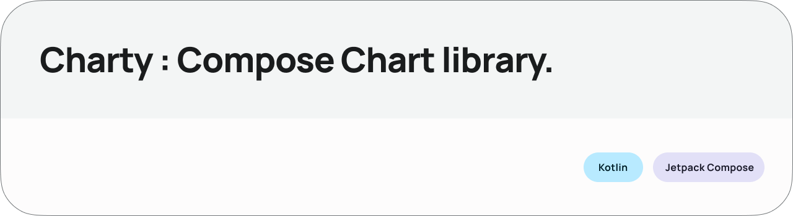

# Project Title

## Charty : Elementary Chart library for Compose

Chart Library built using Jetpack Compose and is highly customizable. (CMP version coming soon)
_Made with ❤️ for Android Developers by Himanshu_

