## Charty : Elementary Chart library for Compose


Chart Library built using Jetpack Compose and is highly customizable. Updates coming soon!
_Made with ❤️ for Android Developers by Himanshu_

[](https://github.com/hi-manshu)
[](https://twitter.com/hi_man_shoe)
[](https://androidweekly.net/issues/issue-532)

## Implementation

### Gradle setup

In `build.gradle` of app module, include this dependency

```gradle
dependencies {
  implementation("com.himanshoe:charty:{version}")
}
```

## Integrating it in your project

You can find the detail implementation of the following:
| Charts        | Preview           |
| ------------- |:-------------:|
| [BarChart](docs/BARCHART.md)      | 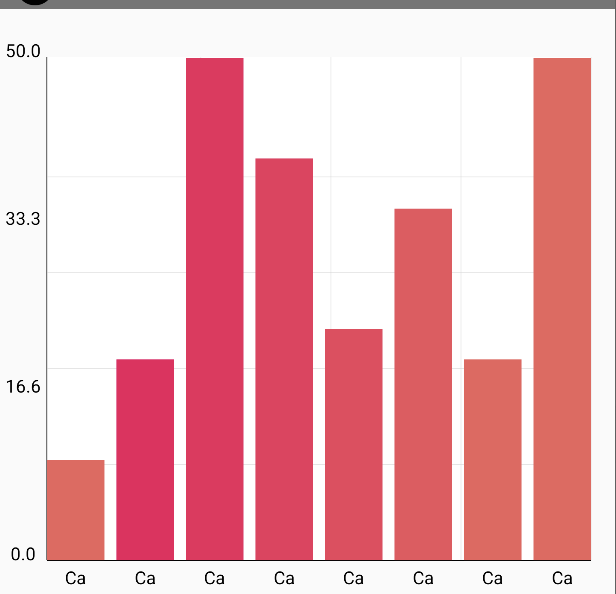 |
| [CandleStickChart](docs/CANDLECHART.md)      | 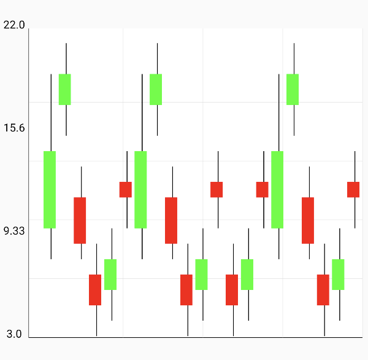 |
| [BubbleChart](docs/BUBBLECHART.md)     |  |
| [StackedBarChart](docs/STACKEDBARCHART.md)     | 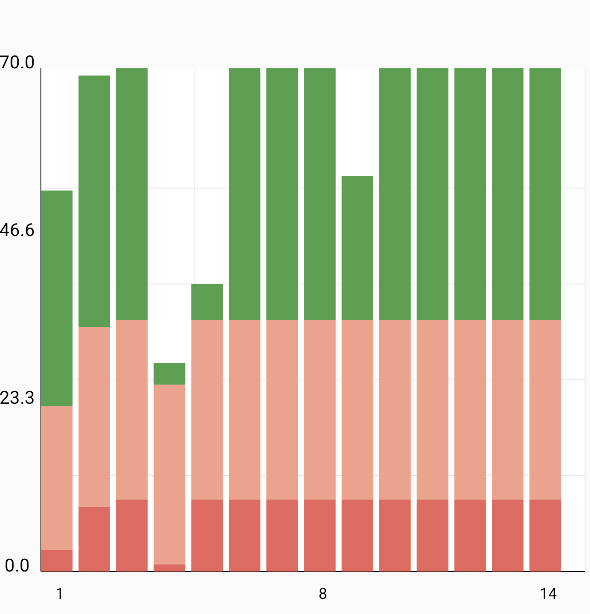 |
| [GroupedBarChart](docs/GROUPEDBARCHART.md)    | 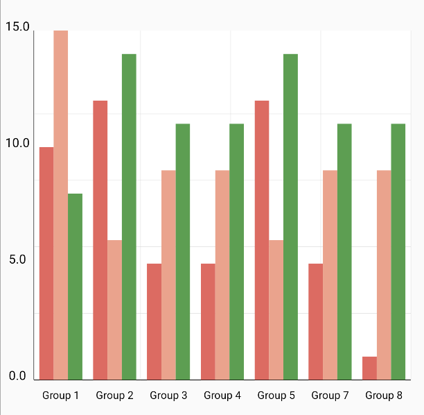 |
| [CircleChart](docs/CIRCLECHART.md)    | 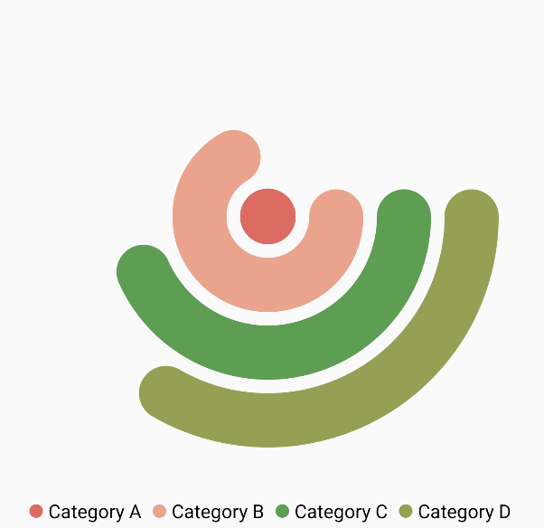 |
| [PointChart](docs/POINTCHART.md)   | 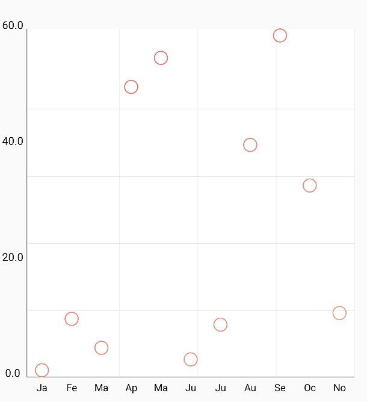 |
| [LineChart](docs/LINECHART.md)  | 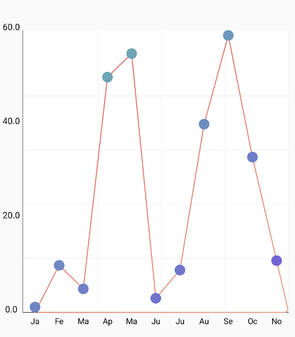 |
| [CurveLineChart](docs/CURVEDLINECHART.md) | 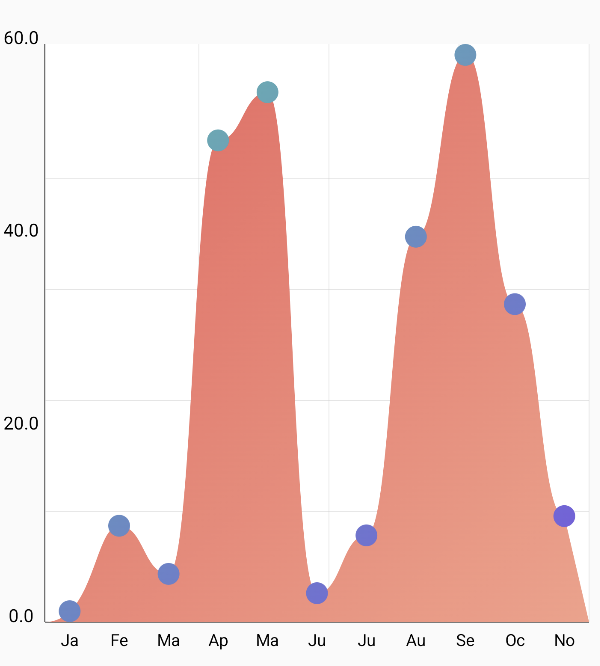 |
| [AreaChart](docs/AREACHART.md) | 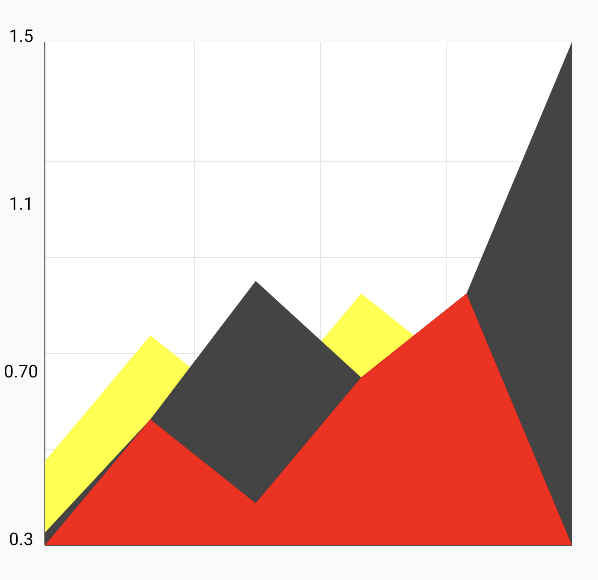 |
| [GaugeChart](docs/GAUGECHART.md) | 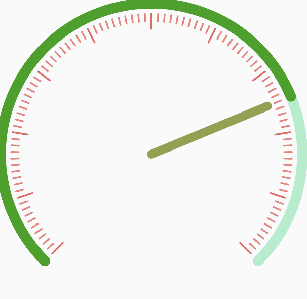 |
| [PieChart](docs/PIECHART.md) | 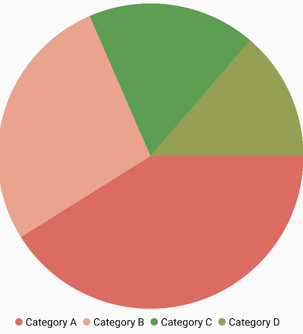 |

### Contribution

Please feel free to fork it and open a PR.

## License

    Copyright 2023 Charty Contributors

    Licensed under the Apache License, Version 2.0 (the "License");
    you may not use this file except in compliance with the License.
    You may obtain a copy of the License at

        http://www.apache.org/licenses/LICENSE-2.0

    Unless required by applicable law or agreed to in writing, software
    distributed under the License is distributed on an "AS IS" BASIS,
    WITHOUT WARRANTIES OR CONDITIONS OF ANY KIND, either express or implied.
    See the License for the specific language governing permissions and
    limitations under the License.