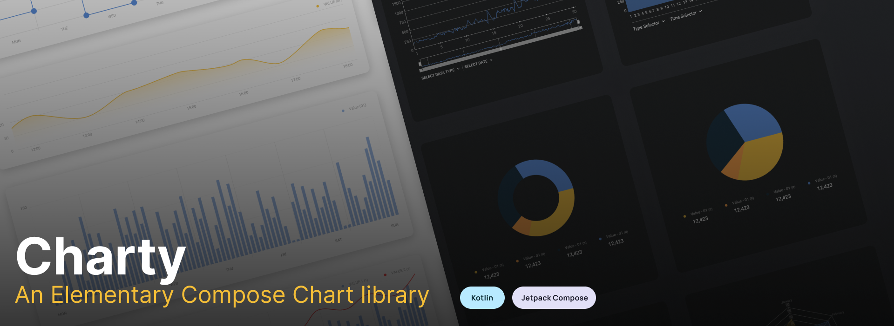

## Charty : Elementary Chart library for Compose



Chart Library built using Jetpack Compose and is highly customizable. Updates coming soon!
_Made with ❤️ for Android Developers by Himanshu_

[](https://github.com/hi-manshu)
[](https://twitter.com/hi_man_shoe)
[](https://androidweekly.net/issues/issue-532)
[](https://github.com/hi-manshu/Charty/releases/latest/download/charty-sample.apk)

## Implementation

### Gradle setup

In `build.gradle` of app module, include this dependency

```gradle
dependencies {
  implementation("com.himanshoe:charty:1.1.3-alpha02")
}
```

## Documentation
You can find the detail implementation of the following:

- [BarChart](docs/BarChart.md)
- [CandleStickChart](docs/CandleStickChart.md)
- [CombinedBarChart](docs/CombinedBarChart.md)
- [HorizontalBarChart](docs/HorizontalBarChart.md)
- [GroupedBarChart](docs/GroupedBarChart.md)
- [GroupedHorizontalBarChart](docs/GroupedHorizontalBarChart.md)
- [CircleChart](docs/CircleChart.md)
- [PointChart](docs/PointChart.md)
- [LineChart](docs/LineChart.md)
- [CurveLineChart](docs/CurveLineChart.md)
- [PieChart](docs/PieChart.md)


### Contribution
Please feel free to fork it and open a PR.


