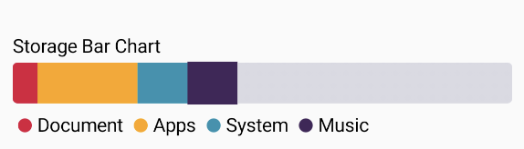

# StorageBar
The StorageBar composable displays a storage bar chart that allows users to visualize different categories and their respective values.

## Parameter
* **data**: A lambda function that returns a list of StorageData representing the categories and their values.
* **trackColor**: The color of the track of type ChartColor. Default is a light gray color.
* **modifier**: The modifier to be applied to the Canvas.
* **onClick**: A lambda function to be invoked when a category is clicked. It receives the clicked data as a parameter.

### Usage

```kotlin
StorageBar(  
    data = { storageData },  
    trackColor = Color(0xD3D3D3DE).asSolidChartColor(),  
    modifier = Modifier.fillMaxWidth().height(50.dp),  
    onClick = { clickedData ->  
        println("Clicked on: ${clickedData.name}")  
    }  
)
```

> You can check ChartColor class to know more how to use colors/extension functions like asSolidChartColor() or asGradientChartColor()